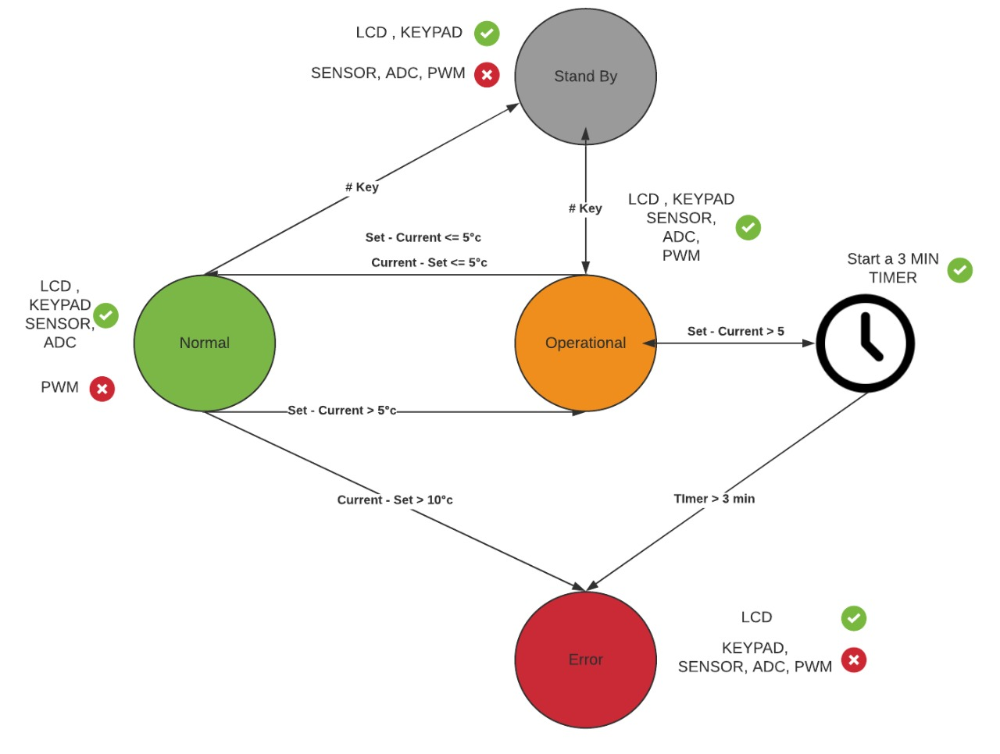
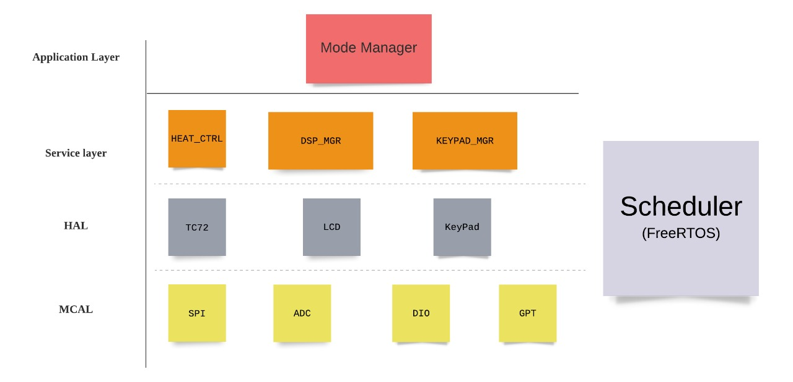
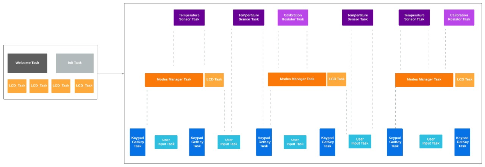

# Temperature-Regulation-and-Monitoring-System
This Repository is for an embedded c project made on proteus simulation that mimic a heater system which regulates the temperature and monitor it.

## System Flow
The system monitors the temperature sensor from the TC72 temperature sensor and tries to regulate it according to a user input through the keypad. according to the difference between the desired temperature from the user and the current temperature from the TC72 temperature sensor, the system tells the user through LCD what is the current the state of the system (Normal, Operational or Error).

## Files Structure
We're using layered architecture and the system is dividied into 4 layers (MCAL, HAL, Service layer and Application layer) as explained in the following figure

## FreeRTOS
We're also including FreeRTOS in our project to make it more realtime and we handled our system with multiple tasks and they're descriped in the following figure 

